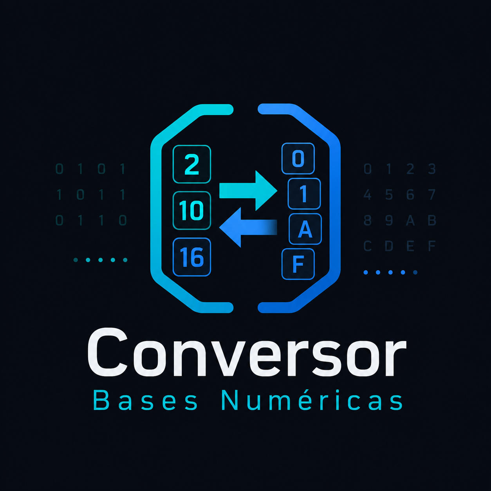

<p align="center">
  
</p>

# 🔢 Conversor de Bases Numéricas


Ferramenta educacional interativa para conversão e operações entre bases numéricas (2 a 36). Inclui conversor com passo a passo, calculadora de operações aritméticas e bitwise, visualizador de bits com complemento de 2, quiz gamificado e atalhos de teclado.

Projeto desenvolvido como trabalho da disciplina **Eletrônica Digital**, do curso de **Engenharia de Computação** da **UNIVASF**, no período **2020.1**, ministrada pelo professor **Romulo Calado Pantaleão Camara**.

## ✨ Propósito

- Auxiliar estudantes na compreensão de sistemas de numeração e conversão entre bases.
- Demonstrar visualmente o funcionamento de operações aritméticas e bitwise em eletrônica digital.
- Ilustrar o conceito de complemento de 2 com um visualizador de bits interativo.
- Oferecer prática gamificada para fixação do conteúdo via quiz com score e streak.
- Disponibilizar uma ferramenta acessível, offline (PWA) e de código aberto para sala de aula ou estudo individual.

## 🕹️ Como Utilizar

### Conversor

1. Digite o valor na base de entrada.
2. Selecione a base de origem e a base de destino.
3. Clique em **Converter** ou pressione `Enter`.
4. Veja o resultado, o passo a passo detalhado e a visualização de bits com complemento de 2.

Você também pode usar os atalhos de teclado para trocar rapidamente a base de saída:

| Atalho | Base |
|--------|------|
| `Ctrl+1` | Binário (2) |
| `Ctrl+2` | Octal (8) |
| `Ctrl+3` | Decimal (10) |
| `Ctrl+4` | Hexadecimal (16) |

### Operações

1. Mude para o modo **Operações** na navegação superior.
2. Insira dois operandos com suas respectivas bases.
3. Escolha a operação e a base de saída.
4. Veja o resultado com passo a passo coluna por coluna.

Operações disponíveis: adição, subtração, AND, OR, XOR, shift left e shift right.

### Quiz

1. Mude para o modo **Quiz**.
2. Um número aleatório é gerado em uma base de origem.
3. Converta para a base alvo e digite sua resposta.
4. Acompanhe seu score e streak de acertos consecutivos.

## ⚙️ Funcionalidades

- **Conversão entre 10 bases**: 2, 3, 5, 7, 8, 10, 12, 16, 20, 36.
- **Passo a passo detalhado** — método polinomial (base → decimal) e divisões sucessivas (decimal → base).
- **Validação inteligente** — só aceita caracteres válidos para cada base.
- **Visualizador de bits** — LEDs interativos com destaque do bit de sinal (MSB) e decodificador de complemento de 2.
- **Largura de bits configurável** — 4, 8, 12 ou 16 bits.
- **Operações aritméticas** — adição e subtração em qualquer base, com detecção de carry, borrow e overflow.
- **Operações bitwise** — AND, OR, XOR, shift left e shift right.
- **Quiz gamificado** — números aleatórios, feedback imediato, score, streak e confetti em acertos.
- **Atalhos de teclado** — `Ctrl+1` a `Ctrl+4` para troca rápida de base de saída.
- **Histórico persistente** — até 50 conversões salvas no navegador (localStorage).
- **URL compartilhável** — estado sincronizado nos query params (`?val=1010&from=2&to=10`).
- **Copiar resultado** e **copiar link** com feedback visual.
- **Troca rápida de bases** — botão de inverter entrada ↔ saída.
- **Design dark mode** com Tailwind CSS.
- **100% responsivo** — funciona em desktop e mobile.
- **Acessibilidade** — skip link, roles ARIA, regiões de live region e navegação por teclado.
- **PWA instalável e offline** — manifest, service worker (Workbox) e ícones.

## 🧰 Tecnologias

- **React 18** para a interface declarativa.
- **TypeScript** para tipagem estática.
- **Vite 6** para desenvolvimento e build.
- **Tailwind CSS v4** para estilização utilitária.
- **Lucide React** para ícones.
- **Canvas Confetti** para animações de celebração (quiz).
- **Vitest** para testes unitários.
- **vite-plugin-pwa** (Workbox) para funcionalidade offline.

## 📁 Estrutura

```txt
src/
  lib/
    converter.ts          — Lógica de conversão matemática
    arithmetic.ts         — Adição e subtração em qualquer base
    bitwise.ts            — AND, OR, XOR e shifts
    twosComplement.ts     — Codificação e decodificação de complemento de 2
    quiz.ts               — Motor do quiz gamificado
    quiz-education.ts     — Conteúdo educacional do quiz
    storage.ts            — Persistência no localStorage
    utils.ts              — Utilitários (cn, etc.)
  components/
    ConverterPanel.tsx    — Painel principal de conversão
    OperationsPanel.tsx   — Calculadora de operações aritméticas e bitwise
    QuizPanel.tsx         — Modo quiz
    BitVisualizer.tsx     — Visualizador de bits com LEDs e complemento de 2
    StepsPanel.tsx        — Passo a passo expansível
    HistoryPanel.tsx      — Histórico de conversões
    HelpDialog.tsx        — Tutorial integrado
    AppHeader.tsx         — Cabeçalho com controles
    ui/button.tsx         — Componente Button (padrão shadcn/ui)
  App.tsx                 — Componente principal com navegação entre modos
  main.tsx                — Entry point
  styles.css              — Estilos globais + tema dark
```

## 🚀 Rodando Localmente

Instale as dependências:

```bash
pnpm install
```

Inicie o servidor de desenvolvimento:

```bash
pnpm dev
```

Execute os testes:

```bash
npx vitest run
```

Gere o build de produção:

```bash
pnpm build
```

Pré-visualize o build:

```bash
pnpm preview
```
